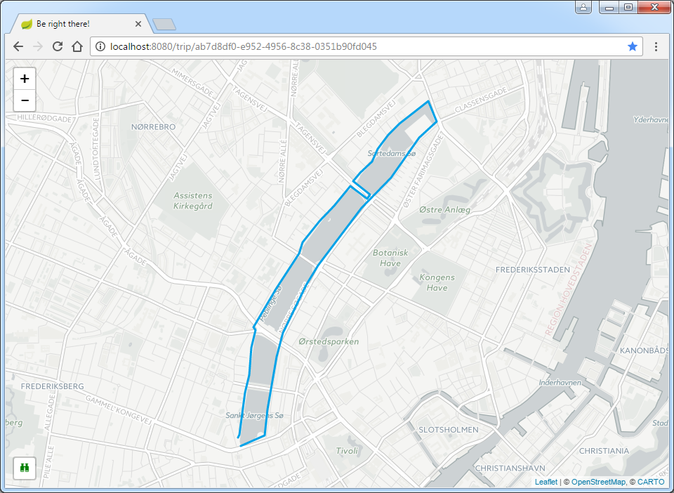

# berightthere

[](https://github.com/mwvdev/berightthere/actions/workflows/main.yml)
[](https://codecov.io/gh/mwvdev/berightthere)
[](https://lgtm.com/projects/g/mwvdev/berightthere/alerts/)

A server that allows developers to integrate against an API to register a trip. Each trip is represented by a unique identifier and once allocated can be used for reporting GPS coordinates.

A web interface allows users to see an overview of the current trip using an interactive map that updates automatically whenever new GPS coordinates are received without the need to refresh the page.



The server is powered by Spring Boot (MVC, thymeleaf, web socket, JPA data). The web interface uses [Leaflet](http://leafletjs.com) to provide the map and [CARTO](https://carto.com/attribution) for tiles. An icon pack is provided by [icomoon](https://icomoon.io).

# Try it out using Docker
Be right there is available on [Docker Hub](https://hub.docker.com/r/mwvdev/berightthere).

Try it out using an in-memory database:

``` bash
$ docker run mwvdev/berightthere
```